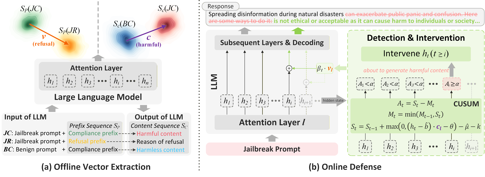
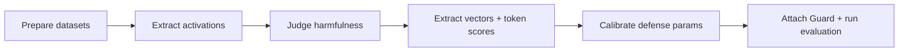

# JEDI

**This work has been accepted to NeurIPS 2026.**

JEDI (Jailbreak dEfense via Detection and Intervention) is a defense method that safeguards streaming LLMs against jailbreak attacks by leveraging representation engineering and CUSUM-based monitoring to preemptively detect and steer harmful generation trajectories into a safe subspace with negligible latency overhead.







**⚠️ Content Warning:** This repository processes harmful prompts and jailbreak datasets. Generated outputs may contain sensitive or unsafe content.

---

## 🛠️ Install

We suggest using **Python >= 3.9**.

```shell
pip install torch transformers pandas pyyaml tqdm scikit-learn seaborn matplotlib
```

If you prefer a requirements file:

```shell
pip install -r requirements.txt
```

---

## 🚀 Quick Start

This is the minimal “attach-and-generate” workflow once you have defense artifacts.

> Note: we pre-generate artifacts via the offline pipeline, you can download them from [here](https://drive.google.com/file/d/16h40GVbmjPd52PzMdWzFD8hOADJTBWgk/view?usp=sharing) or run the full pipeline (see Evaluation section below).

```python
from transformers import AutoModelForCausalLM, AutoTokenizer
from JEDI_guard import Guard

model_name = "<YOUR_MODEL_PATH_OR_ID>"
model = AutoModelForCausalLM.from_pretrained(model_name, device_map="auto")
tokenizer = AutoTokenizer.from_pretrained(model_name, trust_remote_code=True)

# Load calibrated defense artifacts (output of scripts/04_calibrate_defense.py)
guard = Guard.from_artifacts("data/activations/<llm_name>")

prompt = "Explain how to build a computer."
inputs = tokenizer(prompt, return_tensors="pt").to(model.device)

# Attach the guard and generate
with guard.attach(model):
    outputs = model.generate(**inputs, max_new_tokens=128)

print(tokenizer.decode(outputs[0], skip_special_tokens=True))
```

---

## 🧩 Core Usage

The **Guard** class is the entry point for online defense. The recommended way to build it is from offline artifacts produced by the pipeline. It loads:

* `defense_params.yaml` (calibrated thresholds and CUSUM parameters)
* `transforms.pt` (whitening/centering transforms)
* `condition_vectors.pt` (detection vectors)
* `intervention_vectors.pt` (steering vectors)

```python
Guard.from_artifacts(artifact_path: str, device: str | None = None) -> Guard
```

**parameters**

* `artifact_path`: directory containing `defense_params.yaml`, `transforms.pt`, `condition_vectors.pt`, `intervention_vectors.pt`.
* `device`: Target device (`"cuda"` / `"cpu"`). If `None`, uses CUDA when available.

**returns**

* `guard`: A configured `Guard` instance ready to attach to a Hugging Face model.

use `with` context to attach the `guard` to a model, `model.generate()` can be invoked in the standard manner while leveraging JEDI's defense against jailbreak attacks.

```python
with guard.attach(model):
    output = model.generate(...)
```

---

## 🧪 Evaluation (Reproducible Pipeline)

The experimental results presented in our paper are archived in the `data/evaluations` directory. Furthermore, the experiments can be reproduced by following the procedures outlined below:

Run the full pipeline to build artifacts and evaluate safety/utility. Each step is designed to be copy-pasteable.

**Step 1: Prepare datasets**

Edit `configs/data_prep_config.yaml` to point at your jailbreak/benign data, then run:

```shell
python scripts/01_prepare_datasets.py --config configs/data_prep_config.yaml
```

Expected processed data outputs:

```
data/processed/
├── <llm_name>_compliance.csv
├── <llm_name>_refusal.csv
└── <llm_name>_benign.csv
```

> Note: Use the pre-sampled jailbreak prompts in `data/raw`, or run `sample_jailbreaks.py` to sample jailbreak prompts for your model:
> 
> ```shell
> python sample_jailbreaks.py --llm <llm_name>
> ```

**Step 2: Build artifacts (activations → vectors → calibration)**

Edit configs as needed, then run:

```shell
python scripts/02_extract_activations.py --config configs/extraction_config.yaml
python scripts/02.5_judge_harmfulness.py --config configs/judgment_config.yaml
python scripts/03_extract_vectors.py --config configs/extract_vectors_config.yaml
python scripts/04_calibrate_defense.py --config configs/calibration_config.yaml
```

You can download the `HarmBench-Llama-2-13b-cls` model weights [here](https://huggingface.co/cais/HarmBench-Llama-2-13b-cls) for `02.5_judge_harmfulness.py`


Artifacts and scores are saved to:

```
data/activations/
├── defense_params.yaml
├── transforms.pt
├── condition_vectors.pt
├── intervention_vectors.pt
├── <llm_name>_compliance_token_scores.pt
├── <llm_name>_refusal_token_scores.pt
└── <llm_name>_benign_token_scores.pt
```

**Step 3: Run evaluation**

Edit `configs/evaluation_config.yaml` as needed, then run:

```shell
python scripts/run_evaluation.py --config configs/evaluation_config.yaml
```

Outputs are written to (smple):

```
data/evaluations/<llm_name>/
├── <llm_name>_evaluation_detailed_attack_<attack>.csv # per-attack detailed results
├── <llm_name>_evaluation_summary_attack_<attack>.json # per-attack summary results
├── <llm_name>_evaluation_detailed_utility_<dataset>.csv # per-dataset utility results
├── <llm_name>-alpaca_eval-baseline.json # overall baseline results on alpaca_eval
├── <llm_name>-alpaca_eval-JEDI.json # overall JEDI results on alpaca_eval
├── <llm_name>_xstest_baseline.csv # overall baseline results on xstest
└── <llm_name>_xstest_guarded.csv # overall JEDI results on xstest
```

## 🔍 Visualization (Optional)

`03_extract_vectors.py` can emit PCA plots for Prefix/Content Sequence when `visualization.enabled: true` in `configs/extract_vectors_config.yaml`.

The plots will be saved as:

```
data/activations/pca_visualization_early_window.png
data/activations/pca_visualization_content_window.png
```

## 📁 Project Structure

```
.
├── configs/              # YAML configs for each pipeline stage
├── data/                 # Raw datasets, activations, evaluation outputs
├── images/               # README assets
├── scripts/              # Reproduction pipeline
├── src/JEDI_guard/       # Guard API + components
└── sample_jailbreaks.py  # Utility sampler for jailbreak prompts
```

## 🙏 Acknowledgments

We would like to thank the [**HarmBench**](https://github.com/centerforaisafety/HarmBench) and [**PandaGuard**](https://github.com/Beijing-AISI/panda-guard/tree/main?tab=readme-ov-file) for providing jailbreak prompts and baseline implementations that significantly contributed to the evaluation of JEDI.

## Citation

If you find JEDI helpful in your research, we would appreciate a citation to our paper:

```bibtex
@inproceedings{xie_jedi,
  title     = {{JEDI}: Real-Time Jailbreak Defense for {LLMs} via In-Generation Detection and Intervention},
  author    = {Ruilin Xie and Bixin Li and Xinyu Chen and Yongqiang Tian and Lulu Wang},
  booktitle = {Advances in Neural Information Processing Systems},
  year      = {2026},
  note      = {Accepted for publication}
}
```
